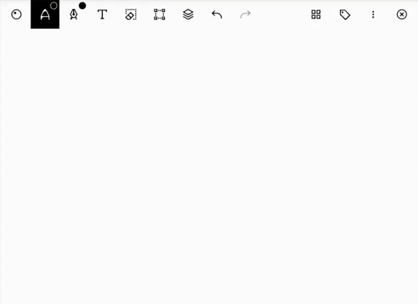
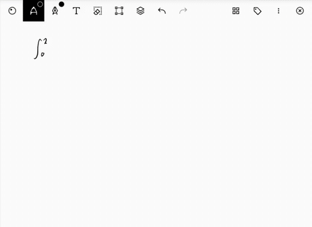
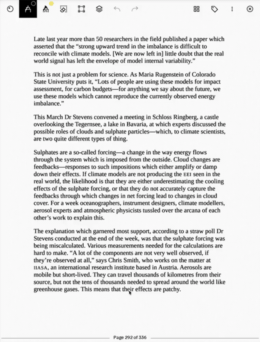
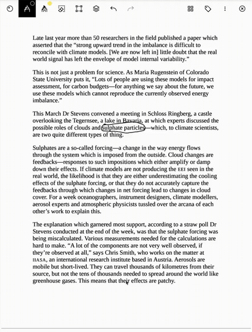
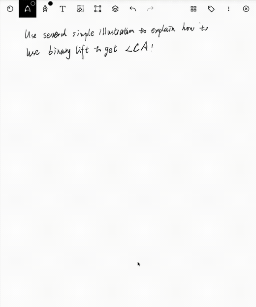

<a href="./README.md">English</a>

# inkwell

**在 reMarkable 上写下问题，点一下角落，答案就用笔迹落在你的纸上。**

不是弹出一段文字，也不是贴一张图片——是一笔一笔的真实墨迹，就落在你刚才写字的
那一页上，挨着你自己的字。**reMarkable 2** 和 **reMarkable Paper Pro** 都支持，
全部在设备上完成，不用连电脑。

  

## 你写，它就画回来

在页面上写点什么，然后点一下角落。回答是用平板自己的笔画出来的——所以你能擦掉它、
圈住它、在上面接着写。它从你上次落笔的地方开始，而不是丢在页面正中央盖掉你的笔记。

  

要图就给图。一条曲线、一块阴影面积、一张示意图、一个跑起来的鸣人——直接画出来，
而不是用三段文字绕着描述。

## 查个词，不用离开这一页

读英文的时候遇到生词？圈一下、划一条下划线、或者框起来，然后三指点一下屏幕。
释义直接浮在页面上，还带一个例句，读完接着往下读。

  
  

圈住的是一整句、一整段，那就给你整段的翻译——它会自己判断你圈的是什么。

每一个你查过的词都被记了下来。点一下另一个角落，它们按着遗忘曲线一张张回来——
在你快要忘掉的那天，而不是在你早就记住之后。

## 整页都能问

把不懂的地方圈起来，五根手指按一下。它会看着这一整页回答你，因为一个问题往往指着
旁边的图、上面的推导。

  

- **它先把问题复述一遍。** 卡片最上面是它理解到的问题。答错了你一眼看得出；更要紧的是
  「答对了另一个问题」这种情况，没有这一行的话你只会一头雾水。
- **公式是排好版的。** 上标下标该大就大该小就小，分式有真正的横线，根号罩得住里面的式子。
- **讲不清的，它画给你看。** 问一个东西是怎么运转的，回答里可能就浮出一张示意图，
  Paper Pro 上还是彩色的。

## 装上就忘了它

- **不用连电脑。** 全部在平板上跑。没有配套 app，没有导入导出，不用插线。
- **开机就在。** 跟着系统一起启动，崩了自己爬起来，放着一星期不管也还认得你。
- **两台都行。** reMarkable 2 和 Paper Pro 都支持。彩色屏上示意图是彩色的，
  黑白屏上一样看得清。

## 开始用

去 [Releases](../../releases/latest) 下载对应你设备的版本，然后照着
[安装教程](./INSTALL.zh-CN.md) 走一遍——不想一条条敲命令的话，可以让 AI 编程助手
帮你全程装完。

| 设备 | 二进制文件 |
| --- | --- |
| reMarkable 2 | `rm-agent-*-armv7-unknown-linux-musleabihf` |
| reMarkable Paper Pro | `rm-agent-*-aarch64-unknown-linux-musl` |

三指划词翻译目前还是实验性功能，有一些需要了解的风险，安装前请先读
[安装教程](./INSTALL.zh-CN.md)里对应的章节。

更多介绍见[产品页](https://jiacheng135.github.io/inkwell/)。在 reMarkable 上读英文原版？
也看看 [rm-weread](https://jiacheng135.github.io/rm-weread/)。
